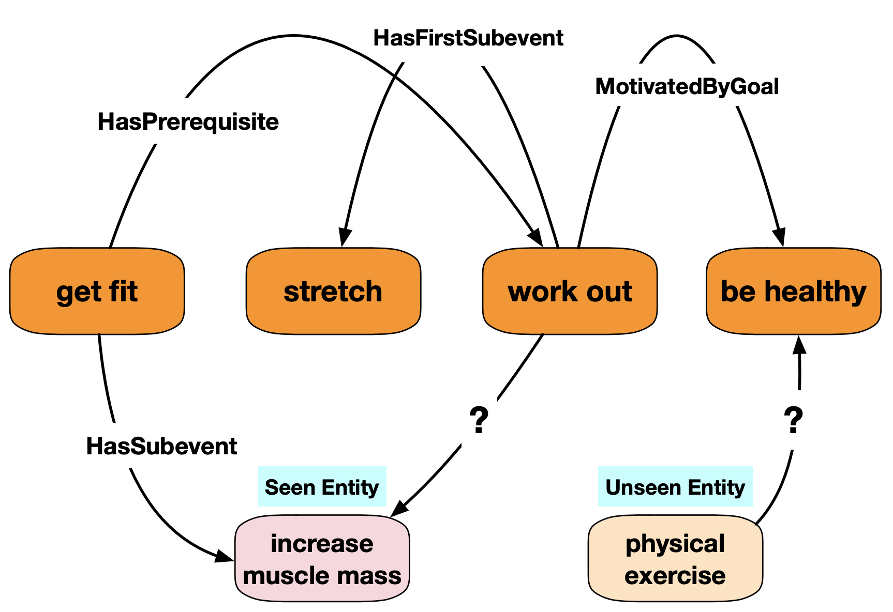

# InductivE: Inductive Learning on Commonsense Knowledge Graph Completion (Overview)

<p align="center">

</p>

In this repo, we mainly provide the following things:
1. Original dataset for CKG completion. (CN-100K, CN-82K, ATOMIC)
2. New dataset splits for inducitve CKG completion evaluation. (CN-82K-Ind, ATOMIC-Ind)
3. Example code to train and evaluate. (Textual feature + GCN (with iterative graph densifier) + ConvE)

For more details, please refer to our paper: [Inductive Learning on Commonsense Knowledge Graph Completion (IJCNN-2021)](https://arxiv.org/pdf/2009.09263.pdf).

# Datasets

All datasets are provided in this Repo. You can find the five datasets in folder ['dataset_only'](./dataset_only). Each dataset contains three files corresponding to 'train', 'validation', and 'test'.

For ATOMIC-related datasets, the triples are organized as 'head-relation-tail'.

For CN-related datasets, the triplets are organized as 'relation-head-tail'. 

Please note when reading the dataset.

# Example Code to Train and Evaluate


## Requirements:
- pytorch=1.4.0
- dgl-cuda10.1
- numpy
- transformers=2.9.1

## Dataset files and pre-computed embeddings

Some files are too large to upload. Please find it through the following link:
https://drive.google.com/drive/folders/1OSKWcv7hmA1oOwcYm4BTKJHX5Zw8OxTF?usp=sharing

## To reproduce the result on ConceptNet-82K

```
    bash train.sh conceptnet-82k 15 saved/saved_ckg_model data/saved_entity_embedding/conceptnet/cn_bert_emb_dict.pkl 500 256 100 ConvTransE 10 1234 1e-25 0.20 0.15 0.15 0.0003 1024 Adam 5 300 RWGCN_NET 50000 1324 data/saved_entity_embedding/conceptnet/cn_fasttext_dict.pkl 300 0.2 5 100 50 0.1
```

## To reproduce the result on ConceptNet-100K

```
    bash train.sh conceptnet-100k 15 saved/saved_ckg_model data/saved_entity_embedding/conceptnet/cn_bert_emb_dict.pkl 500 256 100 ConvTransE 10 1234 1e-20 0.25 0.25 0.25 0.0003 1024 Adam 5 300 RWGCN_NET 50000 1324 data/saved_entity_embedding/conceptnet/cn_fasttext_dict.pkl 300 0.2 5 100 50 0.1
```

## To reproduce the result on ATOMIC

```
    bash train.sh atomic 500 saved/saved_ckg_model data/saved_entity_embedding/atomic/at_bert_emb_dict.pkl 500 256 100 ConvTransE 10 1234 1e-20 0.20 0.20 0.20 0.0001 1024 Adam 5 300 RWGCN_NET 50000 1324 data/saved_entity_embedding/atomic/at_fasttext_dict.pkl 300 0.2 3 100 50 0.1
```


## Citation

If you find our model is useful in your research, please consider cite our paper: [Inductive Learning on Commonsense Knowledge Graph Completion](https://arxiv.org/pdf/2009.09263.pdf):

```
@article{wang2020inductive,
  title={Inductive Learning on Commonsense Knowledge Graph Completion},
  author={Wang, Bin and Wang, Guangtao and Huang, Jing and You, Jiaxuan and Leskovec, Jure and Kuo, C-C Jay},
  journal={arXiv preprint arXiv:2009.09263},
  year={2020}
}
```
